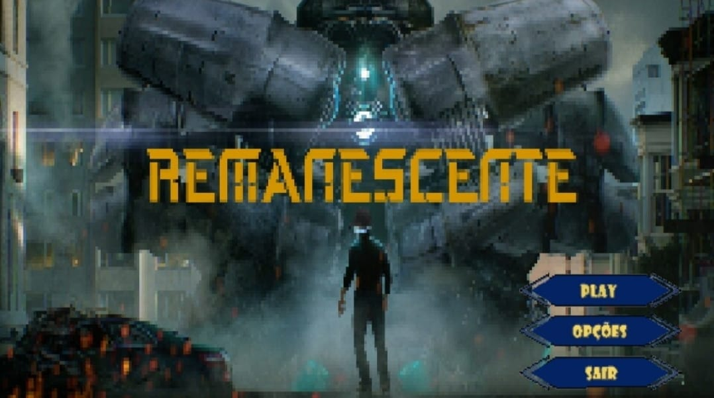

# Remanescente
This a Game in 2D part of my college project to integrate the knowledge acquired during the second semester in 2022. 

Abstract 

In the world of programming there is one professional who has gained prominence in recent years: the game developer. 
The gaming industry moves the entertainment market by billions of dollars every year. During the pandemic, in the year 2020 the industry had its revenue up 23% when compared to the previous year.  Developing a software for game development requires skills such as programming logic and creativity.
In this context there are platforms that specialize in the creation of tools and tutorials for game creation, this is the case of Unity.
Founded in Copenhagen in 2004 by Nicholas Francis, Joachim Ante and David Helgason, Unity started with the ambition of being an open platform for graphic designers, where it is possible to bring together enthusiasts from the programming world in an environment with intuitive back-end architecture.
With an initial investment of over $25,000,000, the company today is valued at approximately $18 billion.
This project aims to present the contribution of the disciplines distribution logistics, business analytics, project management and agile methodology, distributed systems, integrated practices lab IV, software engineering II, mobile development and IOT to the development of a game software.
The game is developed in C# with the Unity platform.  As discussed above, game development requires skills in programming logic, creativity, and when aligned with software engineering techniques adds value to the product and knowledge.
The games market is a sector in wide expansion and totally aligned with the disciplines studied in this course. 
The methodology for the production and development of this game is the consultation of references and periodicals in the area and the application of development tools.
We conclude that this project in the development of a game contributes to our academic growth, intellectual curiosity, and new versions will be implemented, including the benefit to society.

Key Words: game, unity.

:point_right:The game was developed for mobile, and in this first version were implemented the use of 3 weapons, inventory, animation of the main character and enemies: 

:bow:Game start screen, with exit buttons, start and volume options implemented 

:movie_camera:Gameplay in a minute : (sneak peek)

https://user-images.githubusercontent.com/81262462/208971533-8d07aa59-1c3a-4c11-a33a-7a33bf0b1d5d.mp4

